# 🎵 Spotify End-to-End Data Engineering Project

[](https://www.python.org/)
[](https://aws.amazon.com/)
[](LICENSE)
[](https://github.com/BOSS6292/spotify-end-to-end-data-engineering-project)

> **From Zero to Data Flow**: As a complete beginner in data engineering, I built this ETL pipeline to learn how to turn Spotify's API into actionable insights. It's my first real project—simple, but it works!

## 🌟 Why This Project?

I'm new to data engineering, with zero professional experience. I started this to bridge the gap between online tutorials and hands-on practice. Spotify's API was the perfect playground: fun data (tracks, artists, playlists) and a chance to experiment with AWS. The result? A working ETL pipeline that extracts, transforms, and loads data—while teaching me about scalability, errors, and cloud tools.

## 🏗️ Architecture

Here's how the pipeline flows (from my experiments):

```mermaid
graph TD
    A[🎵 Spotify API<br/>Extract: Tracks, Artists,<br/>Playlists] --> B[AWS Lambda<br/>🔄 Transform: Clean &<br/>Enrich Data]
    B --> C[Amazon S3<br/>💾 Load: Store Data<br/>Files]
    C --> D[Glue Crawler<br/>🔍 Discover Schemas]
    D --> E[Glue Data Catalog<br/>📚 Organize Metadata]
    E --> F[Amazon Athena<br/>📊 Query & Analyze]
    B --> G[CloudWatch<br/>📈 Monitor & Log]
```



- **Flow**: API → Lambda (ETL magic) → S3 → Glue → Athena.
- **Why This?**: Serverless setup scales easily, and S3 keeps costs low—perfect for a learner's budget.

## 🛠️ Tech Stack

- **Languages**: Python (my first deep dive, using Requests and Pandas).
- **AWS Services**: Lambda, S3, CloudWatch, Glue Crawler, Glue Data Catalog, Athena.
- **APIs**: Spotify Web API (free and beginner-friendly).
- **Tools**: Git for version control, AWS Console for setup.

## 📋 Setup & Run

1. **Prerequisites**: Free AWS account and Spotify developer app (get API keys here: [Spotify Dashboard](https://developer.spotify.com/dashboard)).
2. **Clone & Install**:
   ```bash
   git clone https://github.com/BOSS6292/spotify-end-to-end-data-engineering-project.git
   cd spotify-end-to-end-data-engineering-project
   pip install -r requirements.txt
   ```
3. **Deploy on AWS**: Create Lambda functions, S3 bucket, and Glue resources via the Console. Add API keys as env vars.
4. **Test It**: Run Lambda manually. Query in Athena with SQL like:
   ```sql
   SELECT name, SUM(total_tracks) 
   FROM "spotify_db"."album_data"
   GROUP BY name;
   ```

## 📊 What It Does & Results

- **Pipeline Output**: Processes ~1,000 tracks in tests, storing them in S3 for quick queries.
- **Example Insight**: Top artists by popularity—export to CSV for simple charts.

## 🤔 Challenges & Learnings (My Journey)

As a fresher, this was a rollercoaster! Spotify's rate limits caused my first crashes—I fixed it with retries. Messy API data taught me cleaning basics. AWS Glue confused me until I debugged step-by-step. The win? Seeing Athena pull insights instantly. It built my confidence in troubleshooting and showed how small wins lead to big skills. Recruiters, this is me learning on the job—ready for more!


## 🤝 Contributing

New to open-source? Me too! Fork, experiment, and PR. Let's learn together.

## 📄 License

MIT License - see [LICENSE](LICENSE).

## 📞 Contact

- **Author**: [Tejas Bomble](https://github.com/BOSS6292)
- **Email**: tejas.bomble@icloud.com
